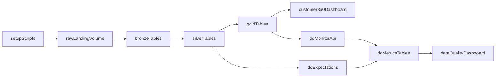

# Databricks Butterfly Medallion + DQ Plan

## Scope and Defaults

- Use **Databricks Asset Bundles** and **SQL Lakeflow pipeline files**.
- Treat `bx4.butterfly.raw_landing` as the Unity Catalog volume source location for generated CSV data.
- Build a medallion flow: raw landing volume -> bronze tables -> silver tables -> gold tables, with Customer 360 output and data quality instrumentation.

## Proposed Project Structure

- [databricks.yml](/Users/robert.leach/dev/vibe/jnj-butterfly-demo/databricks.yml)
- [resources/butterfly_etl.pipeline.yml](/Users/robert.leach/dev/vibe/jnj-butterfly-demo/resources/butterfly_etl.pipeline.yml)
- [src/butterfly_etl/transformations/bronze/](/Users/robert.leach/dev/vibe/jnj-butterfly-demo/src/butterfly_etl/transformations/bronze/)
- [src/butterfly_etl/transformations/silver/](/Users/robert.leach/dev/vibe/jnj-butterfly-demo/src/butterfly_etl/transformations/silver/)
- [src/butterfly_etl/transformations/gold/](/Users/robert.leach/dev/vibe/jnj-butterfly-demo/src/butterfly_etl/transformations/gold/)
- [setup/](/Users/robert.leach/dev/vibe/jnj-butterfly-demo/setup/)
- [monitoring/](/Users/robert.leach/dev/vibe/jnj-butterfly-demo/monitoring/)
- [dashboards/](/Users/robert.leach/dev/vibe/jnj-butterfly-demo/dashboards/)
- [README.md](/Users/robert.leach/dev/vibe/jnj-butterfly-demo/README.md)

## Data Model to Implement

- **Synthetic foundational domains** (CSV in volume): account, contact, consent, product, alignment/territory, employee, transactions, activities/opportunities/cases.
- **Bronze**: append-only ingestion from `read_files('/Volumes/bx4/butterfly/raw_landing/...')` with ingestion metadata.
- **Silver**: typed/clean joins + dedup + business-ready conformance tables (customer, engagement, revenue facts).
- **Gold**: customer-360 marts (customer profile, engagement summary, revenue pipeline, service quality) optimized for dashboard consumption.

## Data Quality Approach

- Add Lakeflow expectations in silver/gold SQL for critical rules (PK not null, valid enum/range, referential checks, freshness).
- Create API-driven table monitors for key output tables using Databricks Data Quality APIs from [monitoring/create_data_quality_monitors.py](/Users/robert.leach/dev/vibe/jnj-butterfly-demo/monitoring/create_data_quality_monitors.py).
- Persist/derive DQ metrics from monitor outputs and Lakeflow event-log expectation metrics into reporting tables.

## Dashboard Deliverables

- **Customer 360 dashboard** JSON definition in [dashboards/customer360_dashboard.json](/Users/robert.leach/dev/vibe/jnj-butterfly-demo/dashboards/customer360_dashboard.json).
- **Data Quality dashboard** JSON definition in [dashboards/data_quality_dashboard.json](/Users/robert.leach/dev/vibe/jnj-butterfly-demo/dashboards/data_quality_dashboard.json).
- Validate every dataset SQL query first (schema check + query execution) before dashboard deployment.

## Implementation Flow

## Validation and Handover

- Run setup scripts to generate CSVs and verify volume paths.
- Deploy and run Lakeflow pipeline; verify row counts and lineage across bronze/silver/gold.
- Execute DQ monitor API workflow and verify monitor artifacts/metrics tables.
- Deploy both dashboards and sanity-check KPIs, filters, and trend visuals.
- Document run commands, configuration variables, and expected outputs in README.

